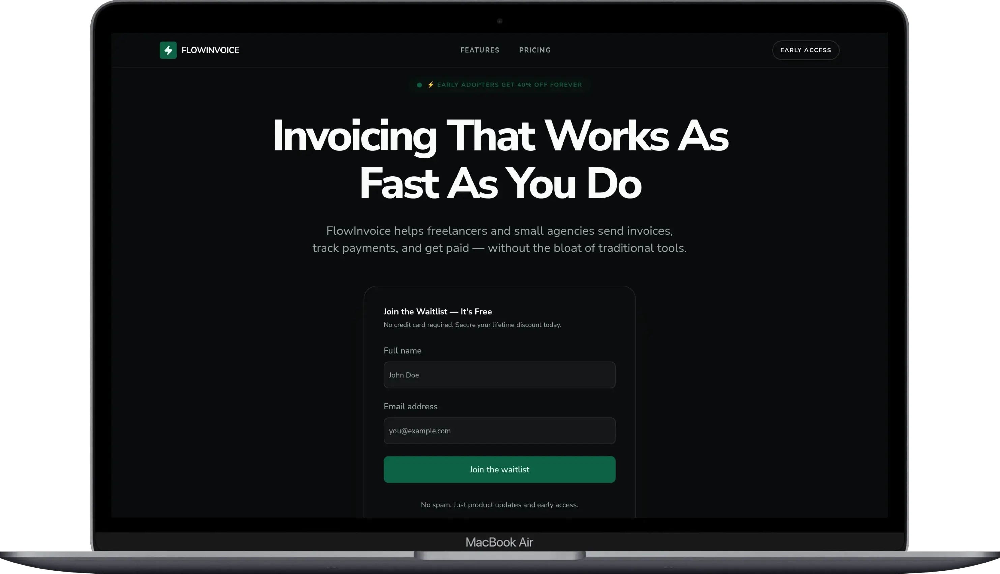

# 📈 Progress Log

Tracking daily execution of the **client-sprint challenge**.

## Day 1 — FlowInvoice ✅

- **Status:** ✅ Completed
- **Type:** SaaS Landing Page (B2B)
- **Live:** [https://flowinvoice-jade.vercel.app](https://flowinvoice-jade.vercel.app)
- **Repo:** [https://github.com/maruf-pfc/flowinvoice](https://github.com/maruf-pfc/flowinvoice)

### 🎯 Goal

Build a high-converting landing page with a waitlist system.

### ⚙️ Stack

- Next.js 16 (App Router + Turbopack)
- Supabase (PostgreSQL)
- Resend (Email API)
- Tailwind CSS v4
- shadcn/ui
- React Hook Form + Zod
- TypeScript

### 🧩 Tasks

- [x] Design landing page structure
- [x] Implement premium UI (Linear/Vercel aesthetic)
- [x] Setup Supabase (waitlist table + RLS)
- [x] Connect waitlist form (Server Actions)
- [x] Add success state + UX feedback (toast + form swap)
- [x] Implement confirmation email via Resend
- [x] Health check endpoint (`/api/health`)
- [x] Deploy to Vercel

### 📝 Notes

- Migrated from Vite + Express to a consolidated Next.js-only architecture
- Removed the separate backend — Server Actions handle all mutations
- Two waitlist entry points (Hero + Bottom CTA) for maximum conversion

### 📸 Screenshot

---

## Day 2 — BrightPeak (AI Chatbot Widget) 🔄

- **Status:** 🔄 In Progress
- **Type:** SaaS Widget (Embeddable)
- **Live:** [https://chatbot-embed-sdk-jade.vercel.app](https://chatbot-embed-sdk-jade.vercel.app)
- **Repo:** [https://github.com/maruf-pfc/chatbot-embed-sdk](https://github.com/maruf-pfc/chatbot-embed-sdk)

### 🎯 Goal

### ⚙️ Stack

### 🧩 Tasks

### 📝 Notes

### 📸 Screenshot

---

## Overall Progress

- Completed: 1 / 30
- In Progress: 1
- Remaining: 28
